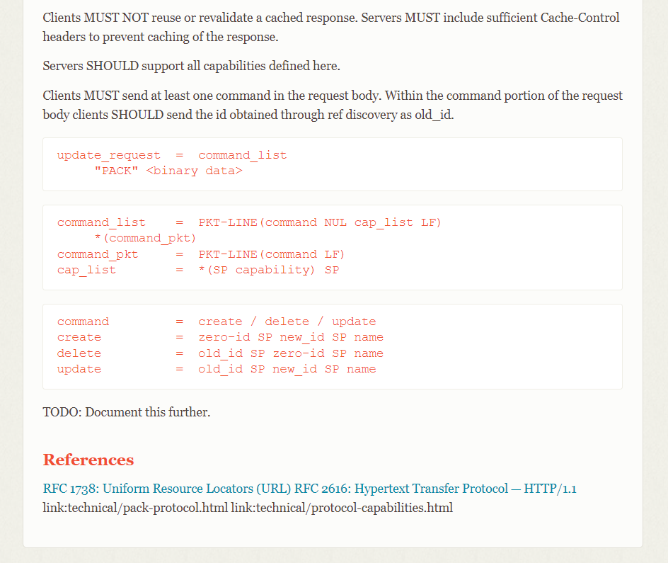

# How to build a git server?

> 正如标题所说的，因为项目需要，我想创建一个（像 GitHub 这种的） git 仓库服务器，而这个文档就是用来记录我在这个过程中的尝试和一些经验。

### 准备

这些是我在开始尝试之前具有的技能或资源：

- git 的基本命令（add, commit, push, pull, merge, rebase, checkout, switch, log），支持大多数日常工作场景
- 一些 http 后端开发技能
- 不太多的 linux 使用以及运维知识
- 一台腾讯云上有公网 IP 的服务器

### 初步尝试

#### git 自带的 ssh 通讯协议

git 自带 http、ssh，以及一种 git 自创通讯协议，其中 ssh 是我最开始尝试的一种。如果 url 的格式是 `git@[hostname]:[path].git` 这种类型，就说明 git 使用的是 ssh 协议。其实 url 中 `@` 符号前的 `git` 就是 username，而 `.git` 就是 path 的一部分；这样看来这其实跟 `ssh [username]@[host]:[path]` 的格式一模一样。

> 本文中所有 [中括号] 在实际操作中都需要替换成实际的内容，例如 host 指代的是服务器的 IP 地址或域名，例如 140.82.114.4 或 github.com ；而 path 指一段服务器上的路径，例如 Criheacy/MyBlog 。


根据上面的分析，我们要首先创建一个叫 git 的用户，并且允许 ssh 连接到它：

```shell
# [on server]

sudo useradd git
# become the "git" user
su git
# navigate to /home/git
cd
mkdir .ssh
chmod 750 .ssh  # 700 if no need for user group
cd .ssh
# create store for pub keys
touch authorized_keys
chmod 640 authorized_keys # 600 if no need for user group
```

为了验证用户的身份，ssh 需要使用公钥/私钥认证。之前生成的密钥对，在 Windows 系统中储存在 `C:\Users\[username]\.ssh` ，在 Linux 系统中则储存在 `~/.ssh` 。如果之前生成过密钥，那可以跳过生成密钥的过程，只需要把密钥添加到服务器上就可以；如果没有，则需要进行以下步骤：

- 使用 ssh-keygen 命令生成密钥对：
  ```shell
  ssh-keygen -t ed25519 -C "[email_address]"
  ```
  这里也可以生成 rsa 密钥：

  ```shell
  ssh-keygen -t rsa -b 4096 -C "[email_address]"
  ```

  我查到的一些资料说 ed25519 性能和安全性会优于 rsa 算法，但是通用性不如 rsa ，一些低版本的 ssh 只支持 rsa 。

  - 这里 -C 可以指定密钥说明信息，不写的话会默认填上路径+用户名的信息（GitHub 上要求填写邮箱地址，没尝试过不填会怎么样）

- 根据提示完成密钥生成过程：

  - 指定密钥储存位置：默认路径即可；如果不是默认路径则需要连接时手动指定
  - 指定签名（passphrase）：填不填都行，如果填写则需要在连接时提供

生成完成之后，将生成的 `.pub` 文件内容复制到服务器上刚才创建的 `authorized_keys` 文件中。可以物理复制（拿张纸条抄过去），如果是本机 ssh 连的服务器也可以 `Ctrl+C` 然后在服务器上 `echo "[Ctrl+V]" >> authorized_keys` 。总之执行 `cat authorized_keys` 之后应该能看到类似下面的内容：

```text
ssh-ed25519 AAAAxxxxxxxx...xxxxxxxx [email_address]
```

若 rsa 生成的则前缀是 ssh-rsa 。

现在客户端已经可以通过 ssh 连接到服务器上的 git 用户了。接下来在服务器上创建 git 的目标仓库：

```shell
# [on server, as user git]

cd
mkdir [repository_name].git
cd [repository_name].git
# create bare repository
git init --bare
```

`repository_name` 可以任意指定，也可以像 GitHub 一样是一段路径（`owner_name/repository_name`），总之能访问到对应的文件夹即可。这个文件夹地址如果不以 `/` 开头，则指代的是 git 的用户根目录（`/home/git/[repository_name]`），与 server 类似。

> 这一步应用在系统中时可以由程序自动完成，即创建项目的 API 收到请求后 RPC 调用管理 git 相关服务的服务端，由这个服务端执行一系列上述脚本命令来创建项目文件夹并创建 git 裸仓库。

如果一切就绪，这时候你就能像 push 到 GitHub 一样 push 到这个服务器上的仓库了：

```shell
# [on developer's PC]
mkdir [repository_name]
# do some changes
git add .
git commit -m "Initial commit"
git remote add origin git@[hostname]:[repository_name].git
git push origin main
```

如果在生成密钥时没有储存在默认路径，而是存储在自定义的位置，就需要为 git 额外添加一条 ssh 配置：

```shell
git config --add --local core.sshCommand 'ssh -i [ssh_key_path]'
```

而如果是同一个仓库下不同远端仓库使用的 ssh 密钥的储存位置不同（其实建议同一个本地密钥上传到多个远端最方便，当然安全性肯定是分开更高），可以参考[这个回答](https://stackoverflow.com/a/7927828)。

同样的，在别的授权过的电脑上也可以把仓库下载下来：

```shell
# [on developer's PC]
git clone git@[hostname]:[repository_name].git
```

到此为止，git 服务端已经能够实现最基本的用户授权以及常规的 git push 和 git pull 等操作了。不过还有个小问题，因为 git 是使用 ssh 进行访问的，上面也能看出来 git 的连接 url 跟 ssh 连接时的 url 很像，所以假如你尝试用 ssh 连接服务器：

```shell
ssh git@[host_name]
```

你会发现这也是可行的。当然我肯定不希望用户能通过 git 以外的方式直接操作服务器上的文件或者做一些其它的危险操作，而 git 也给出了自带的解决方案，即 git-shell 。它能够限制授权的用户在 ssh 连接后只进行 git 相关的操作（也可以自定义放行一些其它的操作）。

git-shell 会随着 git 自动安装，但不一定会出现在系统默认 shell 列表中。所以在使用它之前需要先检查：

```shell
# check system default shell list
cat /etc/shells
# if git-shell is not in the list:
# check if git shell has already installed
which git-shell
# if installed, add its path to the list
which git-shell >> /etc/shells
```

添加完成后，使用 `chsh` 命令来切换用户的 shell：

```shell
sudo chsh git -s [path_of_git-shell]
```

这之后如果再尝试通过 ssh 连接到 git 用户，服务器会提示授权成功，但是拒绝这个连接：

```text
fatal: Interactive git shell is not enabled.
hint: ~/git-shell-commands should exist and have read and execute access.
```

为了全面防止用户通过 ssh 端口转发来间接访问 git 服务器，可以编辑刚才的 `.ssh/authorized_keys` 文件来禁止通过端口转发的方式访问。在要进行限制的授权公钥前面加上：

```text
no-port-forwarding,no-X11-forwarding,no-agent-forwarding,no-pty
```

现在 `cat authorized_keys` 之后应该能看到类似下面的内容：

```text
no-port-forwarding,no-X11-forwarding,no-agent-forwarding,no-pty ssh-ed25519 AAAAxxxxxxxx...xxxxxxxx [email_address]
```

现在用户已经无法通过 ssh 的方式连接到 git 用户了，只能使用规定的 git 命令（例如 git push 、 git pull 等）。

到此为止，这基本就是 git 自带的 ssh 连接方式能够实现的全部功能了。然而这显然还是不够的，我需要 git server 能与现有的网站认证方式进行交互，由 project participant 列表来决定用户对仓库的访问权，而不仅仅是通过 ssh 认证的公钥来「一刀切」地决定访问权限。我判断大致的实现方式是新搭一个后端来接受 git 的网络请求，然后通过 RPC 的方式来调用现有的授权服务接口，不过如何处理 git 网络请求仍是一个难点。

#### http 通讯协议

尽管我知道 GitHub 的 git ssh 通讯协议也能接入它的授权系统（至少证明 ssh 接入也是有可行方案的），但是我们平常还是跟 http 的授权打交道更多一点，而且我以前也只写过 http 后端。所以我准备从 git 使用 http 协议时发送的数据包入手来看看如何接入现有的授权系统。

最初我以为需要自己手写一个后端来处理 git 网络请求，例如处理 git push 或者 git pull 发来的 http 包并根据返回符合标准的响应，从而能被 git bash 理解，其实就是一个已有前端（客户端）和接口文档写服务端的过程。

然而经过我一番查找，就连 [git 的官方文档](https://git-scm.com/docs/http-protocol#_smart_service_git_upload_pack)对 http 协议内部传输规范的介绍也很有限：前面写了一堆似是而非的举例，然后即将讲到重点的时候直接一句 `TODO: Document this further` 然后戛然而止。



我查了一下这篇文档的[源代码](https://github.com/git/htmldocs/blob/de44de3d9e71db785a0bbd06a6ddad8d2c38dd67/technical/http-protocol.txt#L513)，发现最近修改的时间是 2021 年 9 月。git push 这些如此古老的功能竟然到现在还没有文档，真是令人感慨。我还搜到了一些自己实现的 git http backend（比如[这个](https://github.com/asim/git-http-backend)），甚至还有[一篇](https://mincong.io/2018/05/04/git-and-http/)满是逆向工程感觉的「探索」git http 内部协议的博客。看起来想要自己实现一个 git http backend 倒也不是不可能，只是肯定会花费很多时间。

于是我又折回头去看原来的 git 文档。我一开始并非没有注意到 git 自带的 git-http-backend ，这是一个 CGI 脚本（Common Gateway Interface，大概意思是把 url 中的路径映射到服务器的文件系统中，我感觉有点像用作静态路径代理时的 Nginx），能够处理 git fetch 和 git push 的请求。我开始时略过它的原因时我认为它跟 ssh 协议类似，都是只能通过自带的授权认证来放行或阻挡请求（实际上它本体也确实如此）。

但是在想自己写一个 git-http-backend 这个想法陷入困境的时候，我发现其实可以只写一个网关一样的后端，解析请求头通过数据库（或 RPC）来完成权限验证，通过验证的就将请求转发给自带的 git-http-backend ，未通过的就直接返回错误码。
